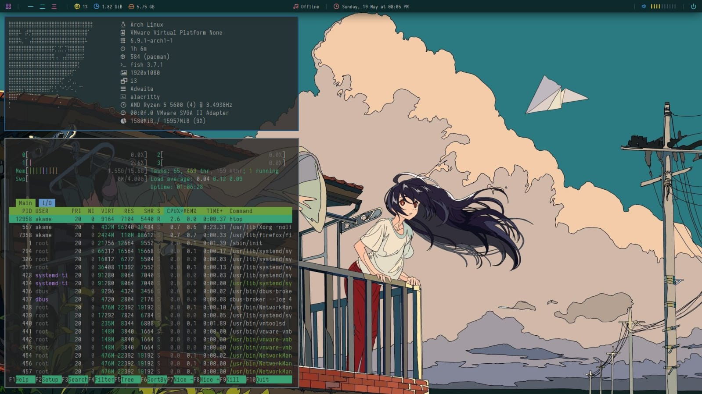
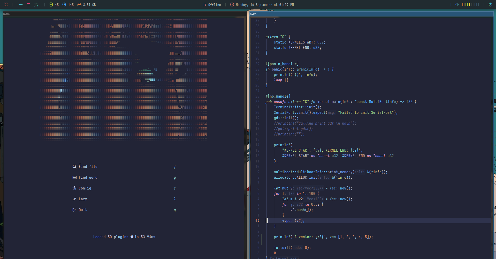

# Dotfiles

dotfiles of my dear **Arch Linux** setup, my main tasks using this environment are **programming** and **cybersecurity**!

### My Setup
**Distro:** [Arch Linux](https://archlinux.org/download/) \
**WM:** [i3](https://github.com/i3/i3) \
**Compositor:** [Picom](https://github.com/fdev31/picom) \
**Shell:** [Fish](https://fishshell.com/) \
**Terminal:** [Alacritty](https://github.com/alacritty/alacritty) \
**Editor:** [LazyVim](https://github.com/folke/lazy.nvim)

### Demo

